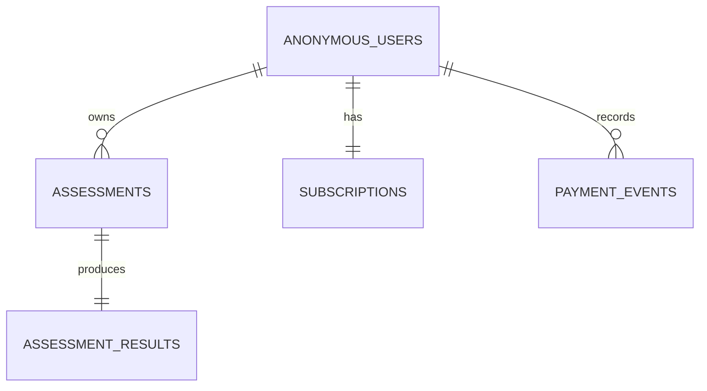

# 数据库 Schema

数据库使用 Prisma + PostgreSQL。Prisma model 使用 PascalCase，真实数据库表名和列名通过 `@@map` / `@map` 映射为 snake_case。

## 表结构

```text
anonymous_users
  id PK
  session_token UNIQUE
  created_at
  updated_at
  last_seen_at

assessments
  id PK
  user_id FK -> anonymous_users.id
  status IN_PROGRESS | COMPLETED
  current_step
  gender
  goal
  age
  height_cm
  weight_kg
  target_weight_kg
  activity_level
  version
  submitted_at
  created_at
  updated_at

assessment_results
  id PK
  assessment_id UNIQUE FK -> assessments.id
  bmi
  bmi_category
  bmr
  tdee
  suggested_calories_min
  suggested_calories_max
  target_date
  summary
  unsafe_target_warning
  prediction_curve JSONB
  created_at
  updated_at

subscriptions
  id PK
  user_id UNIQUE FK -> anonymous_users.id
  status FREE | ACTIVE | EXPIRED
  paid_at
  expires_at
  created_at
  updated_at

payment_events
  id PK
  user_id FK -> anonymous_users.id
  session_token
  type
  status SUCCESS | FAILED
  raw_payload JSONB
  created_at
```

## 关系

```text
AnonymousUser 1:N Assessment
Assessment 1:1 AssessmentResult
AnonymousUser 1:1 Subscription
AnonymousUser 1:N PaymentEvent
```



## 设计说明

- `anonymous_users` 表示匿名访客身份，不是完整注册用户系统。
- `assessments` 支持同一匿名用户拥有多次测评历史。
- `assessment_results` 与测评记录一一对应，保存服务端计算结果。
- `subscriptions` 决定结果接口返回脱敏数据还是完整数据。
- `payment_events` 记录 mock payment 审计事件。
- `prediction_curve` 使用 `JSONB`，便于保存预测曲线数据，同时不把 demo 阶段的曲线结构过早固化成多张表。

